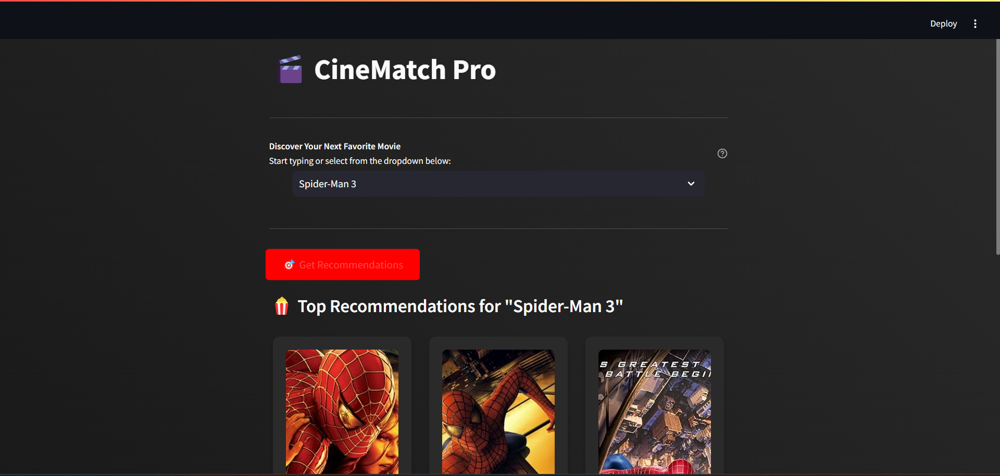

# 🎬 Cine-Match-Pro-Movie-Recommender

## 📌 Overview
The **Movie Recommendation System** is a machine learning-based application that suggests movies based on user input. It leverages **Natural Language Processing (NLP)** and **Content-Based Filtering** to recommend similar movies.

## 🌟 Features
✅ **Movie Search:** Users can enter a movie name to get recommendations.
✅ **Content-Based Filtering:** Analyzes movie descriptions and metadata.
✅ **ML-Powered Suggestions:** Uses machine learning to find similar movies.
✅ **User-Friendly UI:** Built with Streamlit for an interactive experience.
✅ **Poster Display:** Shows movie posters along with recommendations.

## 🛠 Tech Stack
- **💻 Programming Language:** Python
- **📚 Libraries Used:** Numpy, Pandas, Sklearn, NLTK, Ast, Streamlit
- **📊 Dataset:** Kaggle Movie Dataset

## 🔄 Workflow
1️⃣ **User Inputs a Movie Name** 🎥
2️⃣ **System Processes the Input & Analyzes Features** 🧐
3️⃣ **Finds Similar Movies Using NLP & Count Vectorizer** 🧠
4️⃣ **Displays Top 5 Recommended Movies with Posters** 🎞️
### 📺 Screenshots
#### 🎥 Movie Prediction


#### 🍿 Movie Recommendation System


## 🚀 How to Use
1️⃣ **Run the Application** using Streamlit:
```sh
streamlit run app.py
```
2️⃣ **Enter a Movie Name** in the search bar.
3️⃣ **View Recommendations** with posters.

## 📥 Installation
```sh
pip install numpy pandas sklearn nltk ast streamlit
```

## 🔮 Future Enhancements
- 🎭 Improve recommendation accuracy with deep learning.
- 📊 Add collaborative filtering for better suggestions.
- 🌍 Deploy as a web app for global access.

## 👨‍💻 Contributors
- **Ganesh Agrahari** - Developer

## 📜 License
This project is licensed under the MIT License.

